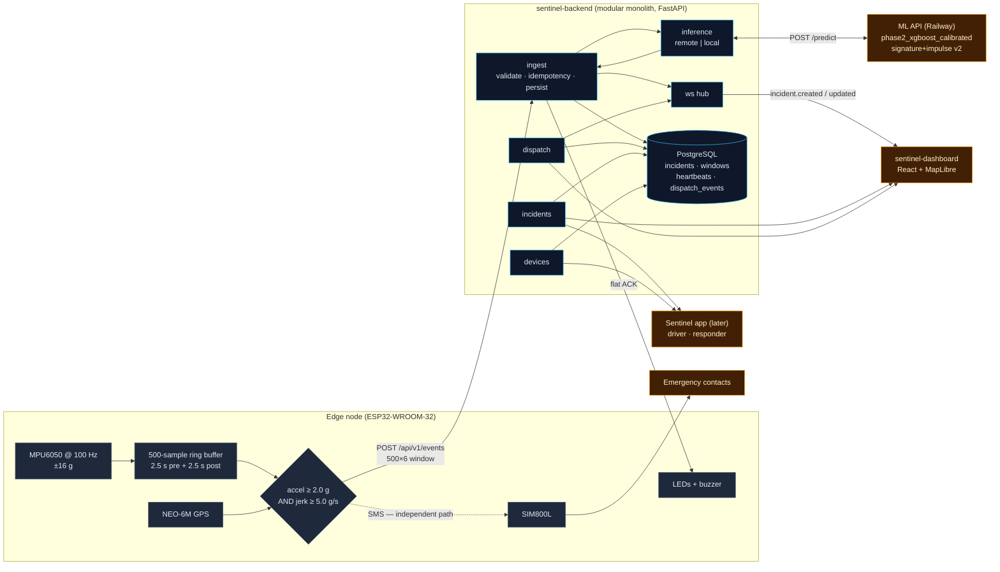

# Sentinel Architecture

## 1. Data flow



The critical topology change from the previous system: **the ESP32 no longer
calls the ML API.** It calls the backend, and the backend is the only component
that talks to the model. This makes the backend the single system of record —
before, a classification existed only in the device's serial log and was lost
the moment the buffer scrolled.

## 2. Component responsibilities

| Module | Owns | Does not |
|---|---|---|
| `ingest` | Payload validation, unit assertion, idempotency, device upsert, persisting the incident + raw window, orchestrating the ML call, broadcasting | Decide severity |
| `inference` | Talking to the ML API with timeouts/retries, or running the vendored model in-process; health reporting | Modify the decision logic |
| `incidents` | Queries, filtering, pagination, serving the stored window | Mutate state |
| `devices` | Device registry, liveness from heartbeat age, heartbeat history | Ingest |
| `dispatch` | The acknowledge → dispatch → resolve state machine, writing `dispatch_events` | Touch classification fields |
| `stats` | Aggregations, excluding `manual_panic` | Recompute classifications |
| `sentinel` | Driver/responder hooks: protection status, panic, contacts | Duplicate responder logic |
| `ws` | Connection registry, 20 s keepalive, fan-out | Persist anything |

### The inference module is a vendored copy, not a reimplementation

`app/modules/inference/phase2_vendored.py` is a verbatim port of the ML API's
inference path — same 20 Hz zero-phase Butterworth low-pass, same 25 features in
the same order, same calibrated model artifact, same signature gate. Local mode
therefore produces byte-identical decisions to remote mode.

This matters more than it looks. Feature extraction duplicated by hand is the
classic source of train/serve skew, and this project has already been burned by a
units mismatch between training and serving. Copying the code is the cheap
insurance; rewriting it is not.

### What the decision logic is, and why it must not be "improved"

```
p_crash = P(Moderate) + P(Severe)
signature = (2 g ≤ peak < 7 g) AND (40 ms ≤ longest excursion above 2 g ≤ 250 ms)

if p_crash ≥ threshold AND signature:  label = max(model_argmax, Moderate)  → model+signature
elif p_crash ≥ threshold:              label = Normal                       → signature_override
else:                                  label = Normal                       → model
```

Severity above Moderate is graded by **impulse** (`≥ 0.959 g·s`, a Δv proxy
around 34 km/h), never by peak height. The old "peak ≥ 7 g ⇒ Severe" escalation
was removed deliberately: VZCrash (27,711 verified real crashes) shows a peak
median of 3.64 g with 99.9 % inside 2–7 g, and the >7 g tail is manoeuvres and
artifacts. A brief 12 g spike from a dropped device is correctly Normal.

Any change that makes peak-g alone drive severity breaks the thesis finding.

## 3. Why a modular monolith and not microservices

The previous iteration of this platform was eleven services with a gateway. For
this tier that would be the wrong trade:

- **One deploy target, one failure domain.** Nine or ten deploy targets in the
  week before a defence is a liability, not an architecture. Every service is
  another place for a cold start, an env var, or a CORS rule to be wrong on the
  day.
- **The boundaries are still real.** `ingest`, `inference`, `incidents`,
  `devices`, `dispatch`, `stats`, `sentinel`, `ws` are separate modules with
  explicit interfaces. The diagram above is drawable as a service diagram, and
  any module could be extracted later without redesign.
- **The transaction that matters spans modules.** "Persist the incident and the
  raw window *before* calling the model" is a single local transaction here. As
  separate services it becomes a distributed write with a failure mode that
  loses crash evidence — the exact outcome the design is trying to prevent.
- **Latency budget.** The end-to-end claim is "responder sees it within
  seconds". Removing inter-service hops removes jitter that would otherwise have
  to be explained.

Scaling was never the constraint. One node reports at most a handful of events a
day, and the ML call dominates the request time.

## 4. The SMS fail-safe is independent by design

The SIM800L path does not consult the backend, does not wait for a
classification, and fires on the device's own threshold decision. That
independence is a **design property, not redundancy to be tidied away**:

- WiFi coverage is the assumption most likely to be false at a real crash site.
  GSM is the one channel that survives it.
- The backend, the ML API, and the network are three separate things that can
  fail. The SMS path shares none of them.
- Failure of the fail-safe must not be coupled to the failure it guards against.

The message keeps the existing field format (severity, peak, confidence,
coordinates, Maps link, satellite count, uptime), using backend values when they
arrived and the device's own measurements when they did not. It is sent whether
or not the POST succeeded.

## 5. Evidence and reproducibility

Every incident stores its raw 500×6 window in `incident_windows`. Phase 1 of
this project did not persist raw windows, and that single omission made a whole
class of follow-up analysis impossible after the fact.

Consequences of storing it:

- the dashboard renders the real captured waveform rather than a summary;
- a misclassification can be replayed offline against a new model;
- `scripts/replay.py` can re-inject any stored capture through the full ingest
  path;
- the thesis has a reproducible evidence trail per detection.

## 6. Reliability decisions

| Risk | Mitigation |
|---|---|
| ESP32 retries after a timeout | `event_id` idempotency — one shake, one incident, inference runs once |
| ML API down at ingest | Incident + window persisted first; `classification_pending`; 60 s background retry; device falls back to local decision |
| Railway deploy broken | `INFERENCE_MODE=local` runs the same model in-process — the defence never depends on that deployment |
| WebSocket drops | Exponential backoff + `?from=` backfill on reconnect |
| Heartbeat competing with a crash upload | Single HTTP mutex; the heartbeat task takes it with zero timeout and skips its turn. A heartbeat is expendable; a crash record is not |
| Clock skew on the device | `detected_at` optional; latency stats discard deltas outside 0–3600 s |
| Sender in m/s² | Ingest rejects with the cause named, rather than silently rescaling |
